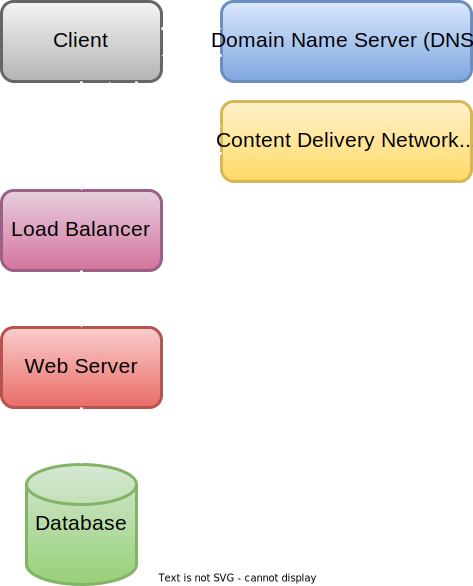

# System Design

System design is the process of defining the architecture, interface, and data for a distributed software system.

# High Level Diagram

!!! tip "High Level Distributed System Diagram"
    <figure markdown>
      
    </figure>

1. Client: user trying to access some software resource
2. Domain Name Server (DNS): client sends requests with a URL, the DNS determines where to route that request. (Whats the IP address that contains the servers to handle request)
3. Content Delivery Network (CDN): servers that handle global regions. Delivers static content for faster response times. 
4. Load Balancer: A server that acts as a reverse proxy. It helps distributes the load to multiple web servers. 
5. Web Sever: Actual server that contains all content and logic for a software resource (website)
6. Database: Data server that stores all information

